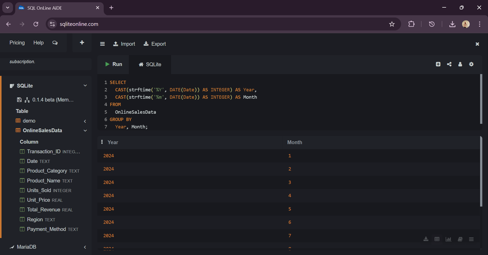
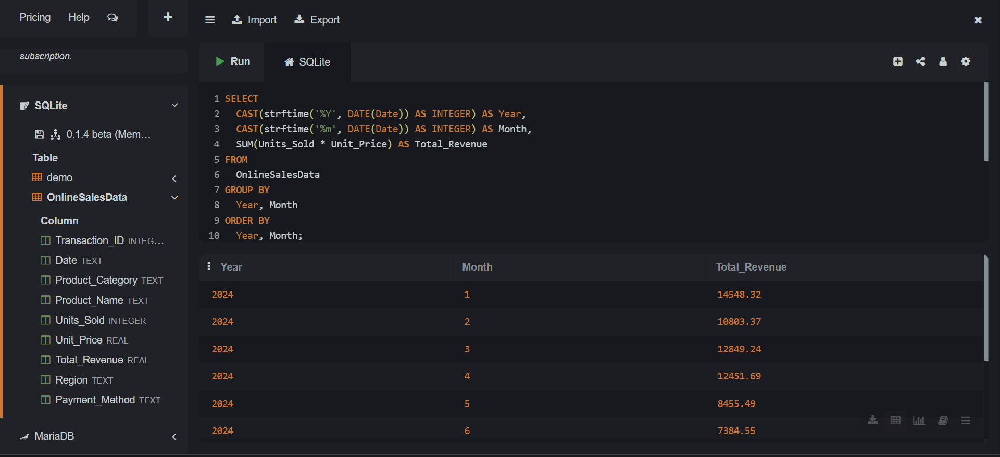
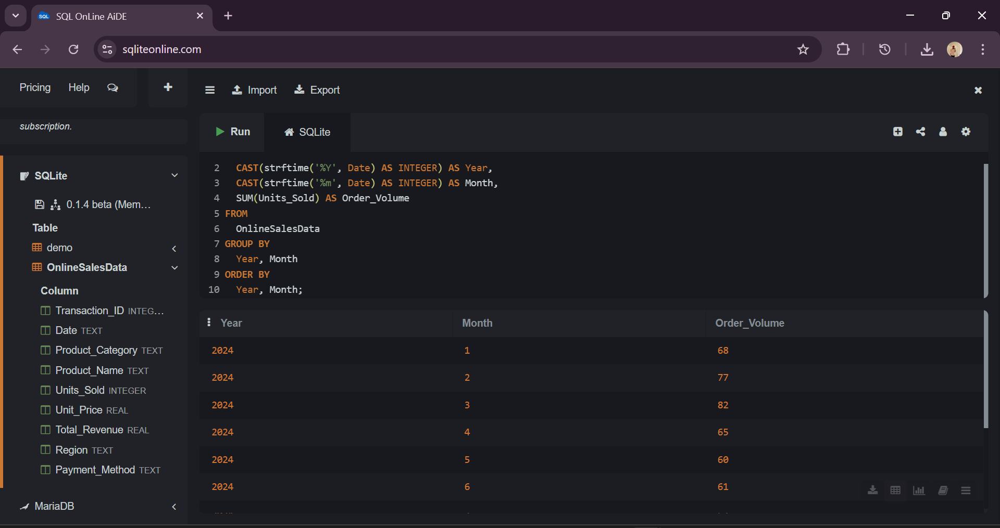
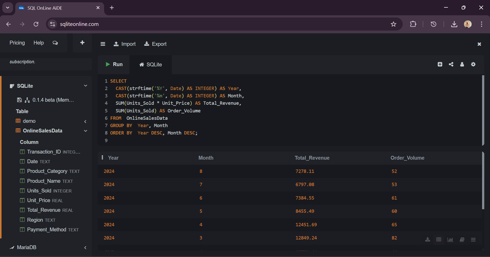
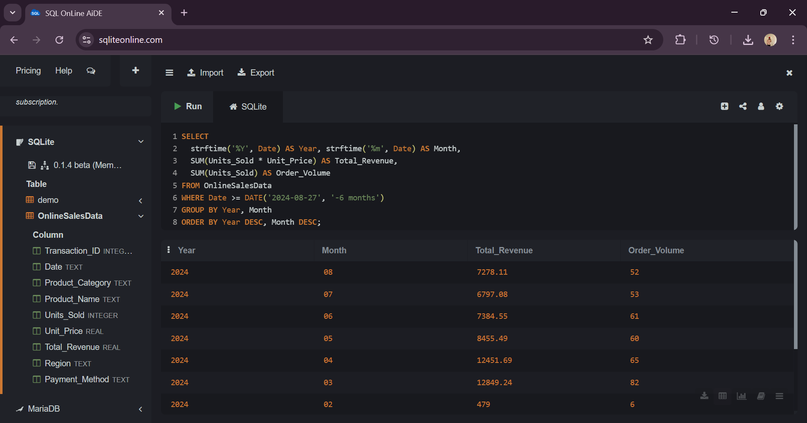

# 📈 Sales Trend Analysis Using SQL

This project analyzes monthly revenue and order volume trends using SQL (SQLite) on the `OnlineSalesData` dataset.

---

## 🗂 Dataset  
**Table:** `OnlineSalesData`  
**Source:** [Online Sales Dataset (Kaggle)](https://www.kaggle.com/datasets/kyanyoga/sample-sales-data)

---

## 🔍 SQL Queries & Insights

### 📅 Group By Year and Month (query1)  
  
Groups orders by year and month.

---

### 💰 Total Revenue by Month (SUM of Sales) (query2)  
  
Calculates monthly total revenue.

---

### 📦 Order Volume (Count of Unique Orders) (query3)  
  
Shows monthly product volume sold.

---

### 📊 Sorted by Most Recent Month (query4)  
  
Revenue and volume sorted by latest month first.

---

### ⏳ Filter by Specific Time Period (Latest 6 Months) (query5)  
  
Filters and displays only the last 6 months of revenue and volume.

---

## 🔗 Author  
**Parampreet Singh**  
[LinkedIn – Parampreet Singh](https://www.linkedin.com/in/muhammad-ahmad-9051a127b/)
